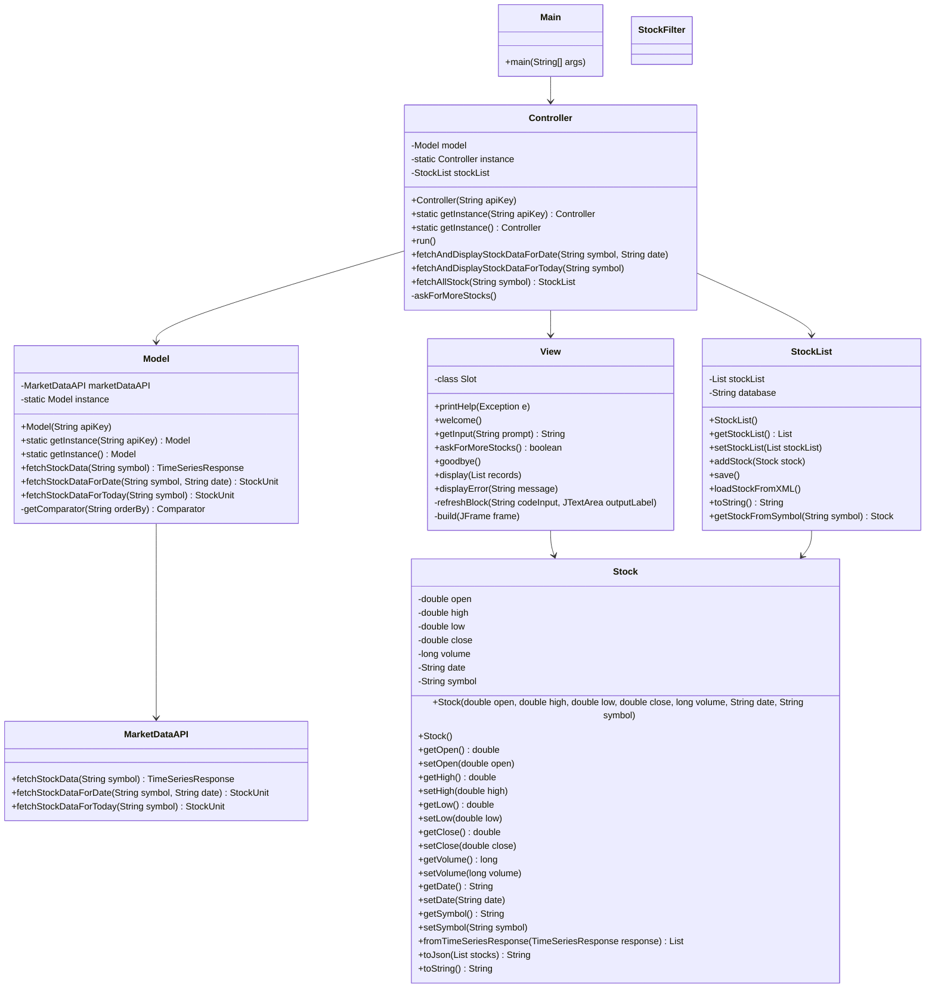
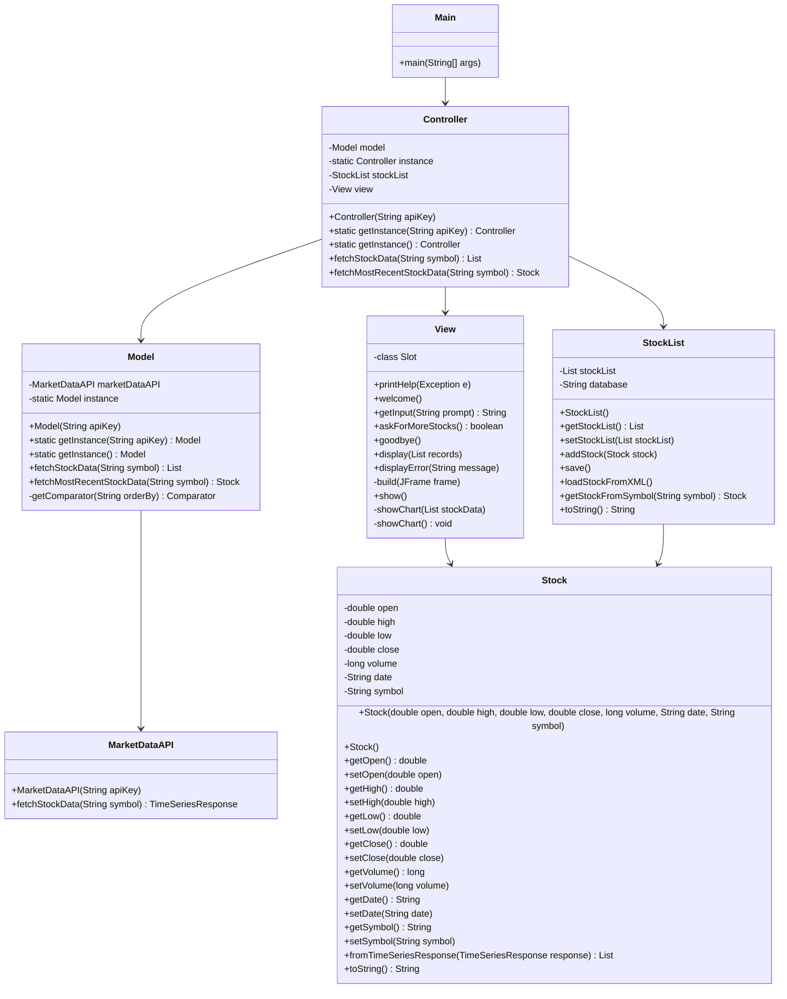

# Stock Data Viewer Application Design

## Overview

The Stock Data Viewer Application is designed to provide users with daily updated stock data and historical data for the last 100 trading days. Users can query stock information, create custom watchlists of stocks, and visualize individual stock performance through detailed line charts. Additionally, the application includes a calendar section that allows users to select individual days and search through historical data visually.

## Design Principles

- **Modularity**: The application is divided into distinct modules (Model, View, Controller) to promote separation of concerns.
- **Reusability**: Components are designed to be reusable across different parts of the application.
- **Scalability**: The architecture allows for easy addition of new features and enhancements.
- **Maintainability**: The codebase is structured to facilitate maintenance and updates.

## Architecture

The application follows the Model-View-Controller (MVC) design pattern, which separates the internal representations of information from the ways that information is presented to and accepted from the user.

### Architecture Decisions

#### Singleton Pattern

The Singleton pattern is employed in both the Controller and MarketDataAPI classes to ensure that only one instance of these classes exists throughout the application lifecycle. This pattern is particularly useful for managing shared resources and providing a single point of access to certain functionalities.

##### Controller Class

The Controller class manages the interactions between the view and the model. By implementing the Singleton pattern, the application ensures that only one instance of the Controller exists, which coordinates the overall application flow. This design simplifies the management of the application’s state and interactions.

##### MarketDataAPI Class

The MarketDataAPI class is responsible for fetching stock data from the Alpha Vantage API. The Singleton pattern is applied here to maintain a single point of access for API interactions, ensuring efficient and controlled usage of the API resources.

#### Benefits of Singleton Pattern

- **Thread Safety**: By having a single instance, it reduces the complexity of handling multiple threads accessing the same resource simultaneously, which can prevent issues such as race conditions and data inconsistencies.
- **Performance**: A single instance of the API handler reduces overhead associated with creating and destroying objects repeatedly, leading to better performance, especially when multiple components need to access the API.
- **Resource Management**: Ensures that resources such as network connections are managed efficiently and are not opened or closed unnecessarily.

## Conclusion

The design of the Stock Data Viewer Application leverages the MVC pattern and the Singleton pattern to create a modular, maintainable, and scalable application. By ensuring that only one instance of the Controller and MarketDataAPI classes exists, the application can efficiently manage interactions and data, providing a robust platform for viewing and analyzing stock market data. The use of the Singleton pattern also enhances thread safety and performance, making the application more reliable and efficient.

## Initial UML

# Initial Design - Stock Data Viewer Application

## Final UML

# Stock Data Viewer Final Inprocess

## Changes Made

### Initial UML

The initial UML represents the proposed design of the Stock Data Viewer Application demo we made. This demo served as a blueprint for the development process, displaying the structure and relationships between various components of the application. The initial design and demo included the main components necessary for a basic functioning version of the application, with placeholders for additional features and methods that were to be implemented.

### Final UML

The final UML illustrates the actual implementation of the Stock Data Viewer Application. This version includes all the methods and functionalities that were added during the development process, reflecting the changes and decisions made to meet the application requirements.

### Changes and Design Decisions

**View Class:**

- **Added Methods: `show()`, `showChart(List<Stock> stockData)`**
  - **Reason:** These methods were added to enhance the user interface by providing functionality to display the main window and to show stock data charts. This improves user experience by allowing visualization of stock data.
  - **Design Impact:** The View class now handles more comprehensive GUI operations, ensuring that the interface is responsive and user-friendly.

**Model Class:**

- **Added Method: `fetchMostRecentStockData(String symbol)`**
  - **Reason:** This method was introduced to allow the application to fetch and display the most recent stock data. This provides users with up-to-date information, which is critical for stock market analysis.
  - **Design Impact:** The Model class now has extended capabilities to handle specific data retrieval tasks, making it more versatile in meeting user needs.

**Controller Class:**

- **Added Methods: `fetchStockData(String symbol)`, `fetchMostRecentStockData(String symbol)`**
  - **Reason:** These methods were added to manage the flow of data between the model and the view, specifically for fetching and displaying stock data. This ensures that the Controller can handle various data display scenarios, providing flexibility in how data is presented to the user.
  - **Design Impact:** The Controller class now has a more comprehensive role in coordinating data retrieval and presentation, ensuring that the application remains consistent and responsive.

**StockList Class:**

- **Added Method: `loadStockFromXML()`**
  - **Reason:** This method allows the application to load stock data from an XML file, providing a way to persist data between sessions. This is crucial for maintaining user data and custom watchlists.
  - **Design Impact:** The StockList class is now responsible for data persistence, ensuring that user data is retained and accessible across different sessions.

### Summary of Changes

The changes made from the initial UML to the final UML reflect a series of design and functionality decisions aimed at enhancing the user experience and ensuring that the application meets its intended use cases. Key additions include methods for displaying the user interface, fetching the most recent stock data, and managing data persistence. These changes were guided by the need to provide a robust, user-friendly application capable of handling real-time stock data and maintaining user preferences.

By implementing these changes, the final design ensures that the Stock Data Viewer Application is not only functional but also scalable and maintainable, allowing for future enhancements and continued user satisfaction.
