# Stock Data Viewer Application Overview

## Overview

The Stock Data Viewer Application is designed to provide users with daily updated stock data and historical data for the last 100 trading days. Users can query stock information, create custom watchlists of stocks, and visualize individual stock performance through detailed line charts. Additionally, the application includes a calendar section that allows users to select individual days and search through historical data visually.

## Design Principles

- **Modularity**: The application is divided into distinct modules (Model, View, Controller) to promote separation of concerns.
- **Reusability**: Components are designed to be reusable across different parts of the application.
- **Scalability**: The architecture allows for easy addition of new features and enhancements.
- **Maintainability**: The codebase is structured to facilitate maintenance and updates.

## Architecture

The application follows the Model-View-Controller (MVC) design pattern, which separates the internal representations of information from the ways that information is presented to and accepted from the user.

### Architecture Decisions

#### MVC Pattern

The MVC design pattern is implemented to separate concerns and improve maintainability:

- **Model**: Manages data and business logic, interacts with the API, processes data, and updates the state of the application.
- **View**: Manages the display and user interface components, presents data to the user, and sends user actions to the Controller.
- **Controller**: Acts as an intermediary between the Model and the View, processes user input, interacts with the Model to retrieve data, and updates the View.

#### Helper Classes

To enhance modularity and maintainability, several helper classes were introduced. Here are a few of them:

- **ActionListenersHelper**: Centralizes the logic for adding event listeners to UI components, simplifying the View class and improving code readability.
- **TableHelper**: Manages table-related operations, ensuring that the View class focuses only on displaying data.
- **ChartHelper**: Handles the creation and display of charts, separating charting logic from the main application logic.
- **PromptDatePicker**: Custom date picker component to handle date ranges based on fetched data, improving the user interface.
- **DynamicBackgroundCanvas**: Provides dynamic background features, enhancing visual appeal without complicating the main UI logic.
- **ViewBuilderHelper**: Assists in building complex UI components, streamlining UI creation, and improving maintainability.

#### Error Handling

Enhanced error-handling mechanisms were implemented to address potential bugs and ensure robustness:

- Centralized error messages using enums, making it easier to manage and update error handling throughout the application.
- Dialog management to handle error messages and user notifications efficiently.

#### Singleton Pattern

The Singleton pattern is employed to ensure that only one instance of certain key classes exists throughout the application lifecycle:

- **Controller**: Ensures a single point of coordination for the application's state and interactions.
- **MarketDataAPI**: Manages efficient and controlled access to API resources, reducing overhead and ensuring resource management.

### Initial UML

## Initial Design - Stock Data Viewer Application

### Final UML

## Stock Data Viewer Final Inprocess

```mermaid

classDiagram
direction TB
    class Main {
        +main(String[] args)
    }

class View {
    +printHelp(Exception e)
    +welcome()
    +getInput(String prompt) String
    +askForMoreStocks() boolean
    +goodbye()
    +display(List<Stock> records)
    +displayError(String message)
    -build(JFrame frame)
    +show()
    -class Slot
    -showChart(List<Stock> stockData)
    -showChart() void
}

class Model {
    -MarketDataAPI marketDataAPI
    -static Model instance
    +Model(String apiKey)
    +static getInstance(String apiKey) Model
    +static getInstance() Model
    +fetchStockData(String symbol) List<Stock>
    +fetchMostRecentStockData(String symbol) Stock
    +fetchSpecificStockDate(Date date) Stock
    +cleanCache()
    -getComparator(String orderBy) Comparator<Stock>
}

class MarketDataAPI {
    +MarketDataAPI(String apiKey)
    +fetchStockData(String symbol) TimeSeriesResponse
}

class Controller {
    -Model model
    -static Controller instance
    -StockList stockList
    -View view
    +Controller(String apiKey)
    +static getInstance(String apiKey) Controller
    +static getInstance() Controller
    +fetchStockData(String symbol) List<Stock>
    +fetchMostRecentStockData(String symbol) Stock
    +fetchSpecificStockDate(Date date) Stock
    +cleanCache()
    +writeTempStockDataToXML(List<Stock> stockData)
    +importStockDataFromFile(File selectedFile, DefaultTableModel tableModel)
}

    class Stock {
      -double open
      -double high
      -double low
      -double close
      -long volume
      -String date
      -String symbol
      +Stock(double open, double high, double low, double close, long volume, String date, String symbol)
      +Stock()
      +getOpen() double
      +setOpen(double open)
      +getHigh() double
      +setHigh(double high)
      +getLow() double
      +setLow(double low)
      +getClose() double
      +setClose(double close)
      +getVolume() long
      +setVolume(long volume)
      +getDate() String
      +setDate(String date)
      +getSymbol() String
      +setSymbol(String symbol)
      +fromTimeSeriesResponse(TimeSeriesResponse response) List<Stock>
      +toString() String
    }

    class StockList {
      -List<Stock> stockList
      -String database
      +StockList()
      +getStockList() List<Stock>
      +setStockList(List<Stock> stockList)
      +addStock(Stock stock)
      +save()
      +loadStockFromXML()
      +getStockFromSymbol(String symbol) Stock
      +toString() String
    }

    class StockList {
      -List<Stock> stockList
      -String database
      +StockList()
      +getStockList() List<Stock>
      +setStockList(List<Stock> stockList)
      +addStock(Stock stock)
      +save()
      +loadStockFromXML()
      +getStockFromSymbol(String symbol) Stock
      +toString() String
    }

    class ApiLimitReachedException {
      +ApiLimitReachedException()
      +ApiLimitReachedException(String message)
    }

    class InvalidStockSymbolException {
      +InvalidStockSymbolException()
      +InvalidStockSymbolException(String message)
    }

    class ActionListenersHelper {
        +addSearchButtonListener(JButton searchButton, JTextField textField, UtilDateModel model, LocalDate today, Controller controller, View view, JTextArea textArea, DefaultTableModel tableSingle, PromptDatePicker datePicker)
        +addDatePickerListener(PromptDatePicker datePicker, Controller controller, DefaultTableModel tableSingle)
        +addImportButtonListener(JButton importButton, JTextArea textArea, DefaultTableModel tableModel, Controller controller)
        +addExportButtonListener(JButton exportButton, JTextArea textArea)
        +addHelpButtonListener(JButton helpButton, JTextArea textArea)
        +addClearButtonListener(JButton clearButton, DefaultTableModel tableModel)
        +addPushButtonListener(JButton pushButton, DefaultTableModel tableModel)
        +addSortByComboBoxListener(JComboBox<String> sortByComboBox, DefaultTableModel tableModel, JTable table)
        +addAddButtonListener(JButton addButton, JFrame frame, DefaultTableModel tableModel)
        +addRemoveButtonListener(JButton removeButton, JTable table, DefaultTableModel tableModel, JFrame frame)
    }

    class ChartHelper {
        +drawLineChart(List<Stock> stockData)
        +drawOHLCChart(List<Stock> stockData)
    }

    class CustomButton {
        +CustomButton(String text)
    }

    class DateLabelFormatter {
        +DateLabelFormatter()
        +stringToValue(String text) Object
        +valueToString(Object value) String
    }

    class DateRangePanel {
        +DateRangePanel(Date minDate, Date maxDate)
        +paintComponent(Graphics g)
    }

    class DialogHelper {
        +showSingleDialog(String message, String title, DialogState state)
    }

    class DynamicBackgroundCanvas {
      +DynamicBackgroundCanvas()
      +paintComponent(Graphics g)
      +run()
    }

    class ErrorMessages {
      INVALID_INPUT("Please enter a stock symbol.")
      API_LIMIT_REACHED("You have reached the 25 times daily limit, please subscribe for unlimited access.")
      DATE_OUT_OF_RANGE("Selected date is outside the valid range: ")
      DATA_NOT_FOUND("No stock data available for the selected date: ")
      INVALID_DATE("Selected date is invalid. Please select a valid date.")
      NO_DATA_AVAILABLE("No data available for the specified symbol: ")
      -String message
      +ErrorMessages(String message)
      +getMessage() String
    }

    class HintTextFieldHelper {
        +HintTextField(String hint)
        +focusGained(FocusEvent e)
        +focusLost(FocusEvent e)
        +getText() String
    }

    class Messages {
      +Messages(String message)
      +getMessage() String
      +apiMessage(String inputText) String
    }

    class PromptDatePicker {
      +PromptDatePicker(JDatePanelImpl datePanel, JFormattedTextField.AbstractFormatter formatter, String promptText, Controller controller)
      +setSearchQueryUsed(boolean used)
      +getSelectedDate() LocalDate
      +updateDatePickerRange(List<LocalDate> dates)
      +isDateWithinRange(LocalDate date)
      +updateDateRangeFromXML()
      +resetLastClickOnButton()
      +resetClearDateAction()
      +resetDateClearedIntentionally()
      +isDateClearedIntentionally() boolean
      +isClearDateAction() boolean
    }

    class TableHelper {
      +updateModelSingle(Stock stock, DefaultTableModel tableModel)
      +updateTableModel(DefaultTableModel tableModel)
      +highLightSelected(String selectedOption, JTable table)
      +setFirstColumnGray(JTable table)
    }

    class ViewBuilderHelper {
      +build(JFrame frame, Controller controller, JTextArea textArea, JPanel chartPanel, View view)
    }

Main --> Controller
Controller --> ActionListenersHelper
Controller --> DialogHelper
Controller --> Model
Controller --> StockList
Controller --> View
ActionListenersHelper --> ChartHelper
ActionListenersHelper --> CustomButton
ActionListenersHelper --> DateLabelFormatter
ActionListenersHelper --> DateRangePanel
ActionListenersHelper --> DialogHelper
ActionListenersHelper --> DynamicBackgroundCanvas
ActionListenersHelper --> ErrorMessages
ActionListenersHelper --> PromptDatePicker
ActionListenersHelper --> TableHelper
ChartHelper --> Stock
Model --> MarketDataAPI
Stock --> StockList
View --> ChartHelper
View --> DynamicBackgroundCanvas
View --> ErrorMessages
View --> Stock
View --> ViewBuilderHelper
```

## Key Architectural Changes and Modularization Efforts

### Initial Design

- The initial design, which was a demo, included broad classes under MVC with multiple responsibilities. It also had very limited functionalities and features.

### Final Design

- The final design introduced several helper classes to offload specific responsibilities from the main classes, particularly the View class. This change significantly improved modularization, making the application easier to maintain and extend. There was a significant increase in functionalities and features.
- Along with the increase in features, modularity also came with increased bugs and errors. The final design included a more robust error-handling mechanism to address these issues.

## Key Helper Classes Added

### 1. ActionListenersHelper

- **Purpose**: Centralizes the logic for adding action listeners to various UI components.
- **Impact**:
  - Simplifies the View class by moving event-handling logic out of it.
  - Makes it easier to manage and update event listeners without modifying the core UI logic.
  - Enhances code readability and separation of concerns.

### 2. TableHelper

- **Purpose**: Manages the logic for updating and interacting with table models.
- **Impact**:
  - Encapsulates all table-related operations, improving cohesion.
  - Allows for easier updates and maintenance of table functionalities.
  - Reduces the complexity of the View class by handling table updates externally.

### 3. ChartHelper

- **Purpose**: Handles the creation and display of different types of charts, such as line charts and OHLC charts.
- **Impact**:
  - Separates the charting logic from the main application logic, enhancing modularity.
  - Facilitates easier updates and additions to chart types without affecting other parts of the application.
  - Improves the maintainability of the visualization components.

### 4. PromptDatePicker

- **Purpose**: Custom date picker component with added functionalities to handle date ranges based on fetched data.
- **Impact**:
  - Enhances the user interface by providing a more interactive and user-friendly date selection mechanism.
  - Modularizes date-related logic, making it easier to manage and extend.
  - Reduces the complexity of the View class by handling date picking externally.

### 5. DynamicBackgroundCanvas

- **Purpose**: Provides dynamic background features for the application.
- **Impact**:
  - Enhances the visual appeal of the application.
  - Encapsulates background rendering logic, keeping it separate from other UI components.
  - Allows for easy updates and changes to the background without affecting the core UI logic.

### 6. ViewBuilderHelper

- **Purpose**: Assists in building complex UI components and layouts.
- **Impact**:
  - Streamlines the creation and setup of UI components, reducing boilerplate code in the View class.
  - Enhances the maintainability of the UI by centralizing the building logic.
  - Improves code readability and reduces duplication.

## MVC Architecture and Modular Enhancements

### Final Design

- The final design adheres more closely to the MVC architecture, with clear separation between the Model, View, and Controller layers. This separation ensures better encapsulation and maintainability.

### Model-View-Controller (MVC) Overview

#### Model

- **Responsibilities**: Manages data and business logic. It interacts with the API, processes data, and updates the state of the application.
- **Key Classes**:
  - **Model**: Fetches and processes stock data using `MarketDataAPI`.
  - **StockList**: Manages the list of stocks, including loading and saving data to XML.

**Encapsulation Enhancements**:

- **Helper Integration**: Helper classes such as `TableHelper` interact with the Model to fetch and display data, ensuring that the data handling logic is isolated and easily maintainable.

#### View

- **Responsibilities**: Manages the display and user interface components. It presents data to the user and sends user actions to the Controller.
- **Key Classes**:
  - **View**: Main class for UI interactions.
  - **PromptDatePicker**, **DynamicBackgroundCanvas**, **ViewBuilderHelper**: Modular components that enhance specific parts of the UI.

**Encapsulation Enhancements**:

- **Helper Classes**:
  - **ActionListenersHelper**: Centralizes event listener logic, reducing the complexity of the View class.
  - **ChartHelper**: Encapsulates charting logic, allowing the View to display different types of charts without managing the details of chart creation.
  - **TableHelper**: Manages table updates, ensuring that the View focuses only on displaying data rather than managing it.
  - **DateLabelFormatter**, **HintTextFieldHelper**, **CustomButton**: Improve reusability and encapsulation of UI elements.

#### Controller

- **Responsibilities**: Acts as an intermediary between the Model and the View. It processes user input, interacts with the Model to retrieve data, and updates the View.
- **Key Classes**:
  - **Controller**: Coordinates interactions between the View and Model.
  - **DialogHelper**: Manages dialogs, ensuring that the Controller can display messages to the user without directly manipulating the View.

**Encapsulation Enhancements**:

- **Helper Classes**:
  - **ActionListenersHelper**: Enables the Controller to attach event listeners efficiently, ensuring that the Controller logic is clean and focused on coordinating between Model and View.
  - **DialogHelper**: Encapsulates dialog logic, allowing the Controller to display messages without directly handling UI elements.

## Key Files in the View

### View.java

- **Responsibilities**: Core UI logic, managing user interactions and presenting data.
- **Enhancements**:
  - Reduced complexity by offloading specific UI tasks to helper classes.
  - Improved maintainability by focusing on high-level UI operations.

### PromptDatePicker.java

- **Purpose**: Custom date picker component with extended functionalities for date range selection.
- **Impact**:
  - Provides an interactive and user-friendly date selection mechanism.
  - Allows date range updates based on fetched data, improving user experience.

### DynamicBackgroundCanvas.java

- **Purpose**: Manages dynamic background rendering for the application.
- **Impact**:
  - Enhances visual appeal without complicating the main UI logic.
  - Modularizes background rendering, making it easy to update and maintain.

### ViewBuilderHelper.java

- **Purpose**: Assists in building complex UI components and layouts.
- **Impact**:
  - Centralizes and streamlines UI component creation.
  - Reduces boilerplate code in the View class, improving readability and maintainability.

### ActionListenersHelper.java

- **Purpose**: Centralizes the logic for adding action listeners to various UI components.
- **Impact**:
  - Ensures that GUI components respond correctly to user interactions.
  - Reduces the complexity of the View class by isolating event-handling logic.
  - Improves modularity and maintainability of the codebase.

## Error Handling Enhancements

- **ErrorMessages Enum**: Centralizes error messages, making it easier to manage and update error handling throughout the application.
- **DialogHelper**: Manages dialog windows for displaying errors and messages, ensuring that the Controller can handle errors without directly manipulating the View.

## GUI Component Handling

- **ActionListenersHelper**: Centralizes event listener logic, improving modularity and maintainability. Ensures that GUI components respond correctly to user interactions by isolating event-handling logic.
- **TableHelper**: Manages table interactions, ensuring that data updates and user interactions with table components are handled efficiently and cleanly.
- **PromptDatePicker**: Enhances date selection and validation, providing feedback to the user when incorrect dates are selected.

### Summary of Changes and Enhancements

#### 1. Clear Separation of Concerns

- **Initial Design**: Responsibilities were spread across classes, leading to tightly coupled and less modular code.
- **Final Design**: Strict adherence to MVC principles, with each layer having a clear responsibility.

#### 2. Improved Encapsulation

- **Helper Classes**: Introduced to handle specific responsibilities, improving code organization and reducing the load on primary classes like View and Controller.
  - **ActionListenersHelper**: Centralizes event handling, making it easier to manage and update.
  - **TableHelper**: Manages table data, ensuring that data handling logic is isolated from UI presentation logic.
  - **ChartHelper**: Encapsulates chart creation and display, allowing for easy updates and maintenance.
  - **ViewBuilderHelper**: Assists in building complex UI components, enhancing modularity and reusability.

#### 3. Enhanced Modularity

- **Modular Components**: Custom components like `PromptDatePicker` and `DynamicBackgroundCanvas` modularize specific UI functionalities, making the system more maintainable and scalable.
- **Enums**: Used for constant values and state management, reducing errors and improving code clarity.

### Conclusion

The final design significantly improves upon the initial design by adhering more closely to MVC principles, introducing helper classes for better modularity, and enhancing encapsulation. These changes result in a more maintainable, scalable, and user-friendly application, ensuring a clear separation of concerns and making the codebase easier to manage and extend.
