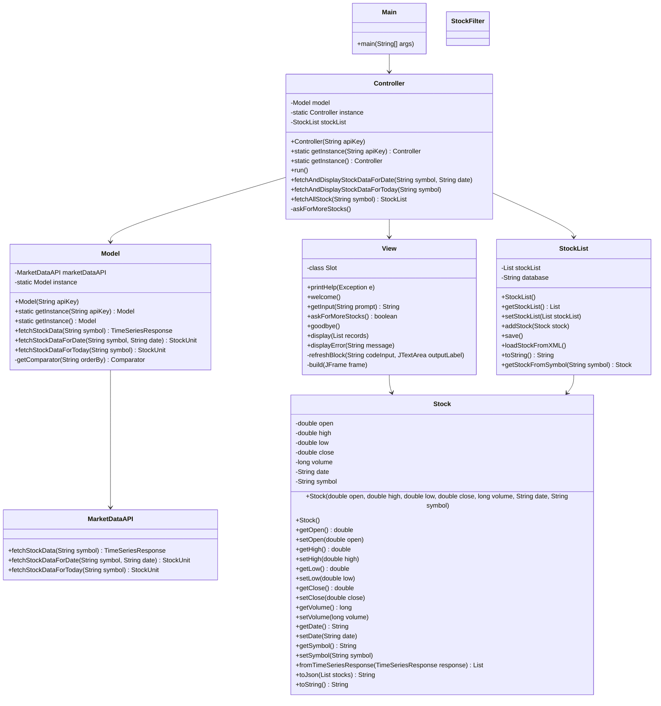

## Proposal

### Team Members

* Jubal Bewick
* Jiazuo Zhang
* Kangning Li
* Aakash Sharma

----------------

* What are you building?

  * Stock Data View Application

* What are the initial features for the application?

  * GUI
  * Collection/database of stock data
  * User can search for a stock by symbol and add these stocks a to list
  * User can see the current price data and volume of the stock for current day and the last 100 tradding days
  * Data will be saved to in xml file format. We will have semi-persistent data storage and persistent data storage

* What are the *minimum* additional features you plan to implement?

  * Users will be able to sort custom watchlists by stock symbol, prices, and volume
  * User can delete a stock from a list
  * Users can save those custom watchlists with custom names and load them later for viewing or editing
  * Using an API to get the stock data
  * Users can view the 100 trading days of stock data as a line graph

* What are your stretch goals (features beyond the minimum)?

  * Users can view the stock data for a specific day within the last 100 trading days by using a calendar to select desired date that is valid
  * Adding visual background to the GUI
  * Adding a feature to compare two stocks

* Go over your initial design.

  * Special emphasis should be placed on how you plan to break it up

  * MVC, presenter, file management, different input validation, testing, documentation, etc.

* How do you plan to break up the work?

* **API & Data Fetching**: Jubal
* **Data Management**: Kangning
* **GUI**: Jiazuo, Aakash
* **Data Filtering**: Aakash

* **Testing**: All members
* **Documentation**: All members
* **UML Diagrams**: Jubal, Jiazuo

* What is your teams timeline and major check-in points?

  * we will meet formally every week
  * goals to be set by members and communication intra-group as needed for implementation and integration of components
  * check-in points will be set by the team and will be flexible based on the progress of the project and terminal date for project

### Deliverables

 • Project Plan Document:
 • Overview of the project, goals, and team roles.
 • Detailed timeline with milestones and check-in points.
 • Description of the initial and minimum viable features.
 • Stretch goals and how they will enhance the application.
 • Initial design diagram (UML).

# Initial Design - Stock Application

