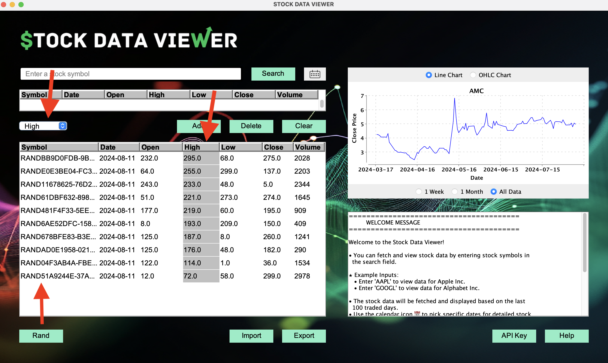

# GUI Testing

## Testing the Graphical User Interface (GUI)

### Key Areas of Testing

- **Open and Closing of GUI**
- **Default and Dynamic Data Display**
- **Button Usage and Functionality**
- **Error Handling with Proper Message Dialog Boxes**
- **Data Export and Import Functionality**
- **Sorting and Filtering**
- **Search Functionality and Date Picker Interaction**
- **Chart Display, Interaction, and Functionality**
- **Text Panel Testing**

## Pre-Test Setup

Before beginning manual testing, the following steps were taken:

- **Automated Testing**:

  - An automated test suite was set up and executed to ensure basic functionality, utilizing `AssertJ-Swing` for testing GUI components and the initial loading of the GUI.
  - The `TestView` class covered visibility and initialization of key components, such as buttons, labels, and panels.
  - The tests ensured that all components, including dynamic backgrounds, buttons, text areas, and charts, were correctly initialized and visible on the GUI.
  - Specific automated tests included:
    - **Component Visibility**: Ensured that all critical GUI components were visible upon application start.
    - **Welcome Message Display**: Validated that the welcome message appears correctly in the text panel.
    - **Dynamic Background and Image Panel**: Confirmed the presence and visibility of dynamic background elements.

- **Manual Validation**:

  - The application was manually run to verify that all features are operational.
  - This included checking components, error and message dialog boxes, charts, and overall UI responsiveness.

With this setup complete, the application is ready for thorough manual testing as detailed in the subsequent sections.

## Manual Testing Plan for GUI Components

This section details the testing process for the critical areas of the application’s GUI, incorporating all relevant helper files from the view, including the latest additions.

### 1. Open and Closing of GUI

#### Test Case 1.1: Application Launch

- **Objective**: Verify that the application launches correctly.
- **Steps**:

  1. Start the application.

     

  2. Ensure that the main window appears without errors, visually confirming automated tests and verify that all initial components (e.g., buttons, text fields) are visible, visually confirming automated tests.

     " width="500">

  3. Confirm that upon exiting the program it closes and displays good bye message dialoague box before closing.

     

- **Expected Result**: The application window should open correctly, displaying all expected components, including dynamic backgrounds and panels. Then upon clicking the close button, the application should display a goodbye message dialogue box before closing.

---

### 2. Data Display

#### Test Case 2.1: Default Dynamic Data Display

- **Objective**: Verify that default data is displayed correctly upon using search button for the first time.
- **Steps**:

  1. Launch the application, observe the initial random data is populated and correctly sorted with symbol as the static sort selection in table and image holder is in place of the chart display until search is performed. After search is performed the chart should display the data in a line chart format with all data preselected, along with the single stock pane displaying the most recent single day stock data. The text panel should continue display the welcome message and no change to the list pane that has random data populated.

     

- **Expected Result**: The application should display the correct default data with proper formatting which should have a prepopulated rand data in the list display pane, the chart displaying initially as a line chart with all data preselected, welcome message in the text panel and the most recent single day stock data in the single stock pane. No error messages should be displayed or inapproapriate graphical anomalies should be present. Key here is only the single stock pane, search text box, and chart should have any dynamic changes.

#### Test Case 2.2: Dynamic Data Loading

- **Objective**: Test dynamic data loading in response to user actions.
- **Steps**:

  1. Perform an the add action that triggers data loading after a search qeuery. In this photo for reference clear button has already been utilized for the list pane for cleanliness.

  
  

- **Expected Result**: The list pane should clear after clicking the clear button without any change to other components. Add add is selected when an appropriate search query has been done the list pane should be updated with the data correctly displayed, again with no other effect on other components that are not coupled with the buttons action listeners.

---

### 3. Button Usage and Functionality

#### Test Case 3.1: Button Click Actions

- **Objective**: Test the functionality of each button that has yet to be tested, look for improper response with correct interaction along with any coupling effects that shouldn't exist.
- **Steps**:

  1. Click on each button not used which would be Rand, Delete, API Key, and Help. Intentionally obmitted the export and import buttons as that is covered in a later test case.

     
     
     
     

  2. Click on data picker and make sure the pop out happens appropriately.

     

  3. Click on the drop down sort menu for list pane and make sure it sorts the data correctly without anomalous behavior in the rest of the components.

     

- **Expected Result**: Each button should trigger the correct action and update the UI accordingly without causing any errors or unexpected behavior in other components.

---

### 4. Error Handling with Proper Message Dialog Boxes

#### Test Case 4.1: Input Validation and Error Messages

- **Objective**: Ensure that invalid inputs trigger the appropriate error messages.
- **Steps**:

  1. Attempt to use date picker without a search qeuery to trigger error handling and proper message dialogue box displayed.

     

  2. Enter invalid data into the search field to trigger error handling with proper message dialogue box displayed.

     

  3. Click invalid date in the date picker pop out for valid date range to trigger error handling with proper message dialogue box displayed.

     

  4. Click out of bounds date in the date picker to trigger error handling with proper message dialogue box displayed.

     

- **Expected Result**: Invalid inputs should be caught, and a proper error message should be displayed. Only one error box should be displayed at a time and no other components should be affected by the error message.

---

### 5. Data Export and Import Functionality

#### Test Case 5.1: Export and Import Data

- **Objective**: Verify that data can be exported with custom name correctly and reimported with no loss of information or formatting errors.
- **Steps**:

  1. Click on the export button and make sure the file explorer pops up and the file is exported correctly and allows the user to name the file. Also verify the destination for the file is set to customlists.

     

  2. Click on import button and make sure the file explorer pops up and the file is imported correctly. Also verify the destination for loading the file(s) is set to customlists.

     

- **Expected Result**: The data should be exported and imported correctly to from with no loss of information and correct formatting. No change to other components should be observed outside of the list pane.

---

### 6. Sorting and Filtering

#### Test Case 6.1: Data Sorting

- **Objective**: Test the sorting functionality of displayed data.
- **Steps**:

  1. Sort the data using different criteria: date, open, close, high, low and volume. In the photos I used random data to show the sorting functionality so as not to expire my API, I found no difference in the sorting functionality between the random data and the API data.

     
     
     
     
     
     

- **Expected Result**: The data should be sorted according to the selected criteria and the selected column should be the only column highlighted in grey. No other components should be affected by the sorting.

#### Test Case 6.2: Data Filtering / Date Picker Functionality

- **Objective**: Test the filtering functionality for parsing search qeuery data that is displayed on the chart as tabular data for a valid specific date in the date range. The display will be in the single stock pane. The date picker will be used to filter the data.
- **Steps**:

  1. Click on the date picker and select a valid date range to filter the data. Verify that the data is filtered correctly and displayed in the single stock pane for the date selected.

     

- **Expected Result**: The JDatePicker component should trigger data filtering based on the selected date from its calendar pop-out. After clearing the date, users can manually select valid dates for the current search query multiple times. This interaction should only affect the single stock pane, leaving all other components unchanged. It is expected that if the user does not clear the date between each selection that date will stay selected as they pan through various months which loads that date on each new month. This will cause error and needs to be cleared before selecting a new date.

---

### Test Case 7.1: Chart Interaction

**Objective**:
Test interactive elements within the chart (e.g., zoom, hover).

**Steps**:

1. Interact with the chart and select time ranges of week, month and all for line chart.

   
   
   

2. Interact with the chart and select time ranges of week, month and all for OHLC chart.

   
   
   

**Expected Result**:
The chart should respond to interactions smoothly and correctly, allowing users to select various time ranges to be displayed in the chart. The chart should be able to use line chart selection and OHLC selection without any effect on the rest of the components.

---
