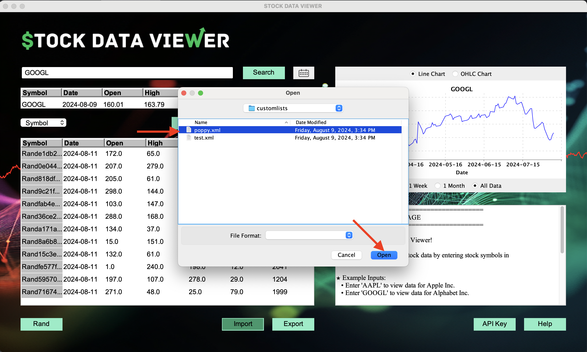

# Manual 

Welcome to the Stock Data Viewer! This guide will help you navigate the application, use its features, and understand its components.

## Overview

The Stock Data Viewer is an application designed to help users fetch and view stock data. The application provides a user-friendly interface to search for stock data by symbol, visualize it in charts, and perform various operations such as adding, removing, importing, exporting, and sorting stock records.

## Main Interface

### Components

**1. Stock Symbol Input**
   - **Text Field:** Located near the top of the window, this text field allows you to enter a stock symbol to search for. The field has a hint text, "Enter a stock symbol", to guide you.

**2. Buttons**
   - **Search:** Next to the text field, this button allows you to search for stock data based on the symbol entered.
   - **Add:** Allows you to add a stock record to the list.
   - **Delete:** Removes a selected stock record from the list.
   - **Clear:** Clears the text area and table, removing any displayed records.
   - **Import:** Imports stock data from a file into the application.
   - **Export:** Exports the current stock data to a file.
   - **Rand:** Generates a random mock stock record.
   - **Help:** Displays a help message with instructions on how to use the application.
   - **API Key:** Opens a dialog to enter or update your API key.

**3. Sorting Options**
   - **Sort By Menu:** Allows you to sort the displayed stock records by various fields such as Symbol, Date, Open, High, Low, Close, or Volume.

**3. Date Picker**
   - **Calendar Icon:** Next to the stock symbol input field, you'll see a calendar icon. Clicking this icon opens a date picker.
   - **Date Picker:** The date picker allows you to select a specific date to retrieve stock data for that day. Once the calendar is opened, it remains visible even if you move your mouse away, ensuring you can easily select a date. The calendar will only close if you click outside the calendar and the icon. After selecting a date, the search will consider this specific date for fetching stock data. The selected date will be cleared when clicking the "x" icon in the calendar.

**4. Text Area**
   - **Text Area:** A large text area where messages are displayed. It is scrollable to allow viewing of all content.

**5. Tables**
   - **Search Result Table:** A table displaying searched record of single stock data. The table provides an overview of various stock data fields: Symbol, Date, Open, High, Low, Close, and Volume.
   - **Stock Data Table:** A table displaying multiple records of stock data. The table is scrollable and provides an overview of various stock data fields: Symbol, Date, Open, High, Low, Close, and Volume.

**6. Chart Panel**
   - **Stock Data Visualization:** A panel for displaying visual charts of the stock data. The chart will dynamically update based on the data being viewed.

### Using the Application

**1. Starting the Application**

Launch the application. The main interface will appear, displaying the components. By default some random data will be generated in Stock Data Table, and a place holder picture will be shown in Chart Panel.

**2. Searching for Stock Data**

Enter the stock symbol into the text field. Click the Search button.

The stock data will appear in the text area, displaying the date, symbol, open, high, low, close, and volume for the specified stock.

You can click the calendar icon to open the date picker, then select a specific date, and search data for this date.

You can also clear the record of changed date in Search Result Table by clicking the "x" icon on the calendar.

**3. Visualizing Stock Data**

After fetching stock data, the chart panel will display a visual representation of the data. This helps in analyzing trends.

By switching between "Line Chart" and "OHLC Chart", you can view graph types of line charts and OHLC charts.

You can also see the graph of data within 1 week, 1 month, or all recent 100 records.

**4. Adding a Stock Record**

After searching for stock data, click the Add button to add the displayed record to the Stock Data Table.

**5. Deleting a Stock Record**

Select the stock record from the table.

Click the Delete button to remove it from the list.

**6.Sorting Stock Data**

Choose a sorting option from the Sort By Menu.

The records in the table will be sorted in descending order based on the selected field.

**7. Clearing Data**

Click the Clear button to remove all displayed data from the text area and the table.

**8. Searching Different Stock Symbol**

By entering another stock symbol and clicking Search button, you can get another result. You can do all previous operations on this new result.

**9. Importing and Exporting Data**

**Import:** 

Click the Import button to load stock data from a file, if you already have the data to import.  

By default, the folder containing the data is the "customlists" folder. XML formated data is required for import. Choose the data you would lik to import, and click "Open".

This will populate the Stock Data Table with data from the selected file.

**Export:** 

Click the Export button to save the current stock data to a file. 

After clicking Export button, a window will pop up to let you save the data to the "customlists" folder by default as XML format.

Then click "Save" to export the data.

**10. Viewing Help**

Click the Help button to view the help message, which provides instructions on how to use the application.

**11. Updating API Key**

Click the API Key button to open a dialog where you can enter or update your API key.

**12. Closing the Application**

When you are done using the application, you can close it by clicking the close button on the window. A farewell message will be displayed before the application exits.

